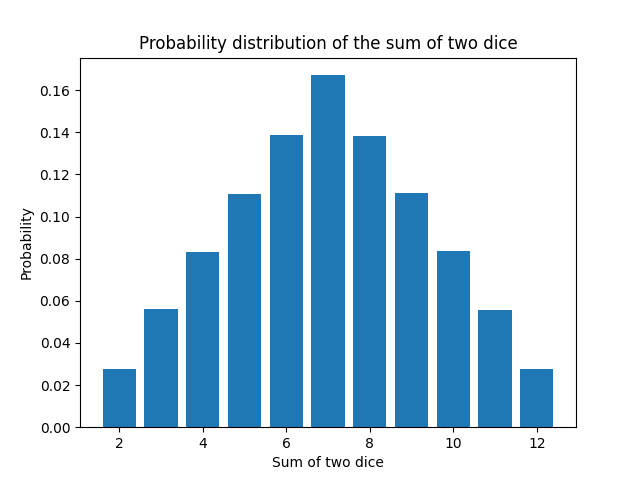

# Algorithms. Final Project

## Problem 1.

For this task, I implemented three functions: `reverse`, `merge_sort`, and `merge_sorted_lists`. The `reverse` function reverses the linked list in place, `merge_sort` sorts the list using the merge sort algorithm, and `merge_sorted_lists` merges two linked lists.

## Problem 2.

This task involves creating a Pythagoras tree using Python's turtle graphics library. The Pythagoras tree, a geometric fractal, is constructed recursively, resulting in an aesthetically pleasing visual pattern.

I utilized the turtle module for graphical rendering, employing command-line arguments to specify the order (recursion level) and segment size of the tree. The draw_pythagoras_tree function, which I implemented, employs recursive logic to draw the tree with branches at specific angles. The incorporation of the turtle graphics library streamlines the translation of recursive logic into a visually compelling representation. This task serves as an exemplar, showcasing recursion's sophistication and effectiveness in generating intricate patterns with concise code.

## Problem 3.

This code demonstrates the implementation of Dijkstra's algorithm for calculating the shortest paths in a weighted directed graph, utilizing Python's heapq library for efficient vertex selection. The task consists of two main parts: constructing and visualizing the graph using the NetworkX library, and computing the shortest paths using a custom implementation of Dijkstra's algorithm.

The `graph_builder` function in the code creates a directed graph from a dictionary, adds weighted edges, and visualizes it, while also using NetworkX's Dijkstra functions to calculate and return the shortest paths and path lengths as a reference. In the second part, the `dijkstra_with_heap` function represents a custom implementation of Dijkstra's algorithm. I've compared my custom Dijkstra algorithm with the NetworkX library function single_source_dijkstra_path_length and obtained the same results. Additionally, I ran the single_source_dijkstra_path function to determine the shortest path.

## Problem 4.

In this task, I defined the function `draw_heap`, which takes an array representing a binary heap and visualizes it as a binary tree layout with the aid of the `networkx` and `matplotlib` libraries.

## Problem 5.

This task focuses on defining a binary tree and visualizing it using both breadth-first search (BFS) and depth-first search (DFS) traversals. The code constructs a binary tree and assigns a unique color to each node based on the order of traversal. It then visualizes the tree using the NetworkX and Matplotlib libraries. The draw_tree function allows for the visualization of the tree with either BFS or DFS traversal, with the colors of the nodes reflecting the traversal path.

## Problem 6.

For this task, I employed two distinct algorithms: a greedy approach and a dynamic programming approach, to address the challenge of selecting food items with the maximum total caloric value within a constrained budget. I implemented two functions, greedy_algorithm and dynamic_programming, each designed to maximize the caloric value of a meal within a specified financial limit.

While executing these two functions, I observed discrepancies in the results. For example, when the budget is set to 100, the greedy algorithm spends only 80 and obtains 870 calories, while dynamic programming spends the entire 100 and achieves 970 calories. This result highlights the limitations of the greedy algorithm. The greedy algorithm selects a locally optimal result, but it does not always lead to the best global optimum. In contrast, dynamic programming calculates all possible outcomes and selects the one that provides the best global optimum.

## Problem 7.

The Monte Carlo algorithm is a computational technique that relies on repeated random sampling to obtain numerical results. It's particularly effective for solving problems that are complex and probabilistic in nature, as it approximates solutions through simulation when exact analytical solutions are difficult or impossible to obtain.

In this task, I employed the Monte Carlo algorithm to calculate the probability distribution of the sum of two dice. I simulated 1,000,000 dice rolls and randomly generated numbers for each dice. The program then calculates the sum of these two numbers and determines their respective probabilities. The results presented in Table x show that the calculations performed using the Monte Carlo algorithm are almost identical to those obtained through analytical methods. It is important to highlight that the Monte Carlo algorithm calculates an approximate result, and its precision depends on the number of data points and experiments.

**Table x: Comparison of Probabilities for the Sum of Two Dice - Monte Carlo Algorithm (1) vs. Analytical Method (2).**

| Sum | Probability 1 | Probability 2 |
| --- | ------------- | ------------- |
| 2   | 2.80          | 2.78          |
| 3   | 5.53          | 5.56          |
| 4   | 8.33          | 8.33          |
| 5   | 11.15         | 11.11         |
| 6   | 13.88         | 13.89         |
| 7   | 16.70         | 16.67         |
| 8   | 13.86         | 13.89         |
| 9   | 11.12         | 11.11         |
| 10  | 8.27          | 8.33          |
| 11  | 5.57          | 5.56          |
| 12  | 2.80          | 2.78          |

**Fig x: Probability Distribution of the Sum of Two Dice.**

